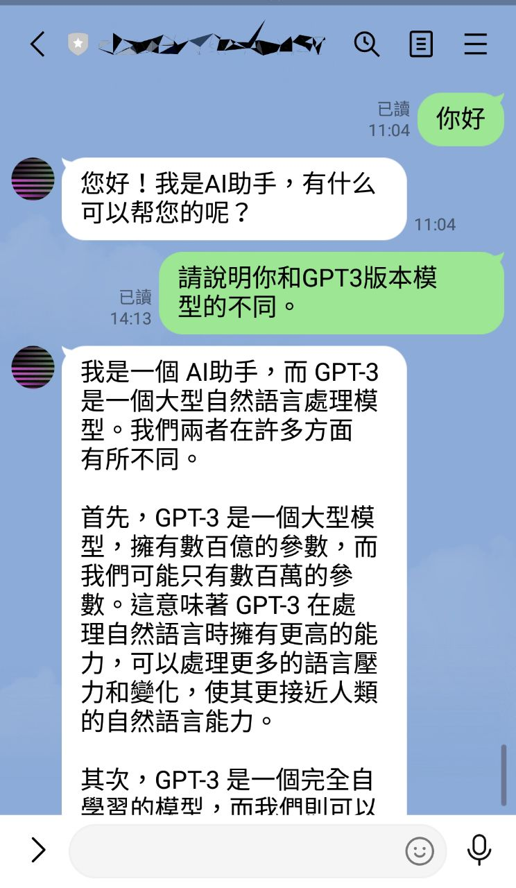
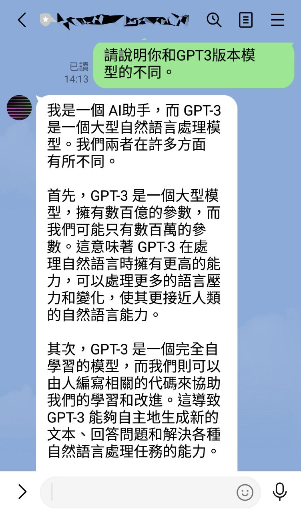

# Django-official-ChatGPT-linebot
# 一個使用Django框架和GPT3.5 turbo/ChatGPT，透過ngrok結合linebot的專案。

# 此文件施工中，請先忽略

  

  

### 5. openai的依賴必須使用0.27.0以上版本。
------
### Line和openai api設置請參考： https://github.com/howarder3/GPT-Linebot-python-flask-on-vercel
